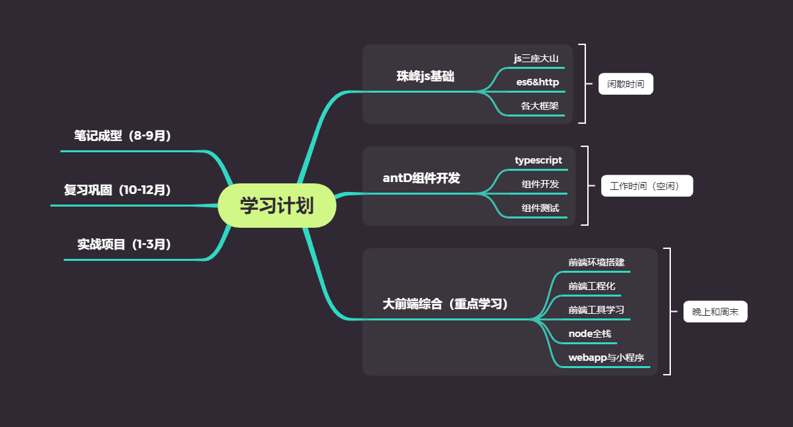

# 学习计划

::: tip 学习目标
   下半年完成对前端系列的学习以及实战：<strong>js => node</strong> 
:::

## 学习大纲

## 课程章节统计

| 珠峰js基础（~40min/节）    | antD组件开发（~10min/节） | 大前端综合（~10min/节）   |
| :----------:               | :----------:               | :-----------:             |
| JS三座大山 56课时           | 基础 1-2章                  | 前端前置知识 1-7周         |
| js实战作业 12课时           | 组件测试 3-5章              | 打通全栈（node）8-13周      |
| es6&ajax-http 35课时       | 组件开发 5-10章              | 前后端分离实战项目  14-17周 |
| 框架篇 79课时               | 组件打包发布11-13章          | webapp与小程序  18-24周    |

## 进度

| 课程            |  笔记成型  |    复习巩固 |    实战项目 |
| :-------------: |----------:| ----------:| -----------:|
| 珠峰js基础       |0%         |0%          |0%           |
| antD组件开发     |0%         |0%          |0%           |
| 大前端综合       |0%         |0%          |0%           |
